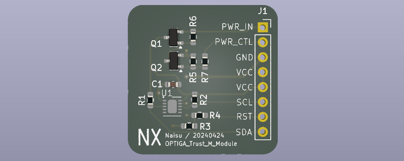

# OPTIGA_Trust_M_Module

## Brief

[Infineon OPTIGA Trust M](https://www.infineon.com/cms/cn/product/security-smart-card-solutions/optiga-embedded-security-solutions/optiga-trust/optiga-trust-m-sls32aia/) IC Board. 

This project is designed with [Kicad](https://www.kicad.org/).

## License
 This work is licensed under a <a rel="license" href="http://creativecommons.org/licenses/by-sa/4.0/">Creative Commons Attribution-ShareAlike 4.0 International License</a>.

